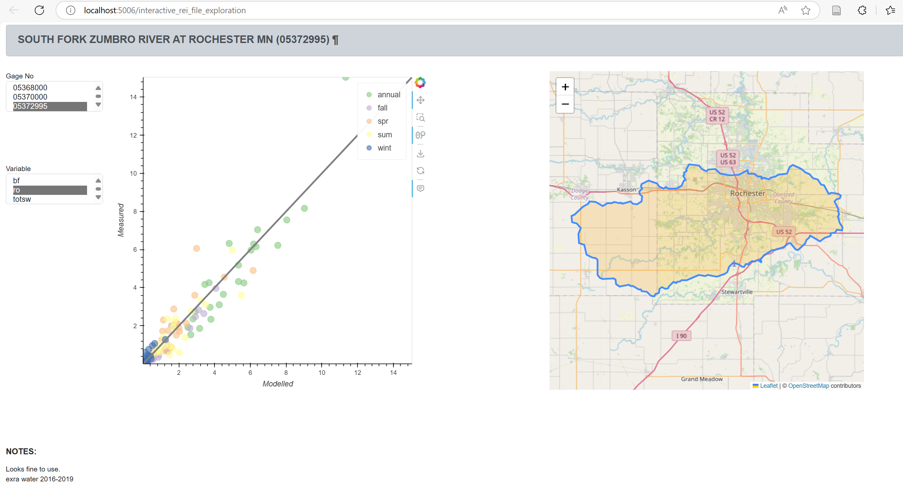

# swb2_calibration-dashboard
[WIP] Python panel application for exploring Pest++ *.rei file with SWB2 output.

This is an experiment aimed at allowing interactive exploration of a Pest++ rei file. A Pest or Pest++ 'rei' file contains the residuals used in parameter estimation to form an objective function to be minimized. More importantly, the file contains observations and modeled values of variables we are interested in. This example 'rei' file contains observations of actual evapotranspiration, as well as observations of net infiltration, surface runoff, and total flow (net infiltration plus rejected net infiltration plus runoff). The observations of actual evapotranspiration are zonal statistics applied to the grids generated by Reitz and others (2023). The net infiltration, surface runoff, and total flow observations are generated by applying baseflow seperation filters to USGS stream gage records.

Baseflow seperation results require a number of assumptions to be made in order to relate back to modeled net infiltration or runoff. The biggest assumption we make is that the groundwatershed and surface watershed are roughly the same. In many parts of the midwest, this may be approximately true, but there are plenty of examples where watersheds are 'leaky': there is significant lateral movement of groundwater into or out of the basin that is never registered at a stream gage. We futher assume minimal flow disruption from dams, field tiles, surface water withdrawals, inputs from sewage treatment plants, and the like. Many of the gages included in this sample are obviously subject to one or more of the previously listed disruptions. 

It is the goal of this application to allow exploration of the gaging basins that underly the observations supplied to Pest++.

To start up the dashboard, first ensure that your Python environment contains the required packages (holoviews, bokeh, panel, pandas, folium). From within the 'python' directory, the dashboard may be started by typing `panel serve interactive_rei_file_exploration.py --show`. This should result in the dashboard being generated and displayed on your default web browser.

### References

Reitz, M., Sanford, W.E., and Saxe, S., 2023, Ensemble Estimation of Historical Evapotranspiration for the Conterminous U.S.: Water Resources Research, v. 59, no. 6, p. e2022WR034012, accessed April, 2025, at https://doi.org/10.1029/2022WR034012.

